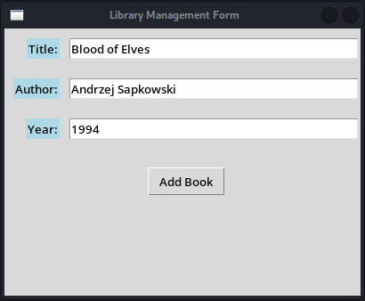
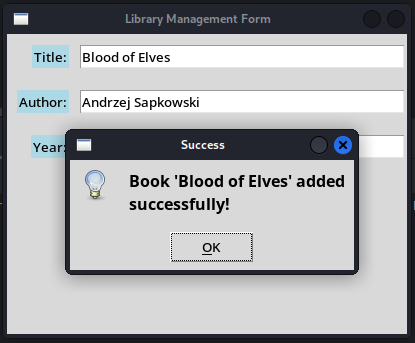
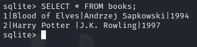

# Library Management System

## Project Description

A library management application written in Python using the Tkinter library and SQLite. It allows users to add, view, and manage books in a simple and user-friendly way.

## Features

- Adding new books to the database.
- Validating the correctness of the data entered by the user.

## Technologies

- Python
- Tkinter
- SQLite

## Screenshots

1. **Adding a Book**:
   
   

3. **Successful Addition of a New Book**:

   

5. **Result of Database Query**:

   

## Requirements

- Python 3.11
- Tkinter library (enabled by default in Python installation)
- SQLite (enabled by default in Python installation)

## Installation

1. Clone the repository to your local computer:
   ```bash
   git clone https://github.com/szymon-tulodziecki/tkinter_form_miniSQL.git
   cd tkinter_form_miniSQL
